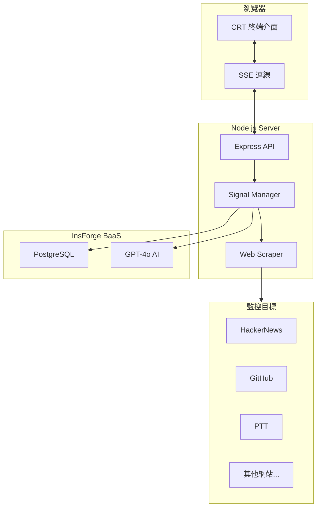

# The Last Sentinel 末世哨兵

[](https://www.gnu.org/licenses/agpl-3.0)
[](https://nodejs.org/)
[](https://insforge.com/)

[<- 回到 Muripo HQ](https://tznthou.github.io/muripo-hq/) | [English](README_EN.md)

末日後的廢土上，你是最後的守望者。監聽殘存的網路訊號，搜尋任何生還者的蹤跡。


> **「也許我是最後一個人，也許不是。但只要還有訊號，我就會繼續守望。」**

---

## 功能特色

- **多頻率監聽**：同時監控多個網站，即時偵測內容變動
- **關鍵字攔截**：設定自訂關鍵字，當目標網站出現時觸發警報
- **AI 威脅分析**：InsForge AI 自動判讀訊號威脅等級與分類
- **CRT 終端介面**：復古陰極射線管螢幕效果，完整的末世氛圍
- **即時串流**：Server-Sent Events 推送，無需重新整理頁面
- **訊號紀錄**：所有攔截到的訊號存入 PostgreSQL，永久保存

---

## 螢幕截圖

### 主控台介面

```
╔════════════════════════════════════════╗
║   THE LAST SENTINEL                    ║
║   WASTELAND SIGNAL INTERCEPTOR v4.0.1  ║
╚════════════════════════════════════════╝

[LINK] Connection established
[SYSTEM] Watch mode initiated - scanning frequencies...
[SCAN] Scanning: HackerNews Feed...
[SCAN] Scanning: GitHub Trending...

╔════════════════════════════════════════╗
║     !!! SIGNAL INTERCEPTED !!!         ║
╚════════════════════════════════════════╝
SOURCE: HackerNews Feed
KEYWORDS: AI, GPT
THREAT LEVEL: MEDIUM
```

### 威脅等級

| 等級 | 顏色 | 說明 |
|------|------|------|
| **LOW** | 綠色 | 一般資訊，無需特別關注 |
| **MEDIUM** | 橙色 | 值得注意的訊息 |
| **HIGH** | 紅色 | 重要訊號，建議立即查看 |
| **CRITICAL** | 閃爍紅 | 緊急訊號，可能影響生存 |

---

## 技術棧

| 技術 | 用途 | 備註 |
|------|------|------|
| Node.js 20+ | 執行環境 | ES Modules |
| Express | Web 框架 | API + 靜態檔案 |
| InsForge | BaaS | PostgreSQL + AI |
| Server-Sent Events | 即時推送 | 單向串流 |
| Tailwind CSS 3.4 | 樣式框架 | 自訂 CRT 主題 |
| Cheerio | HTML 解析 | 網頁爬蟲 |

---

## 系統架構



---

## 快速開始

### 環境需求

- Node.js 20+
- InsForge 帳號（用於資料庫和 AI）

### 安裝步驟

```bash
# 進入專案目錄
cd day-21-last-sentinel

# 安裝依賴
npm install

# 設定環境變數
cp .env.example .env
# 編輯 .env 填入 InsForge API Key

# 編譯 Tailwind CSS
npm run build:css

# 啟動開發伺服器
npm run dev
```

開啟瀏覽器訪問 `http://localhost:3000`

### 環境變數

```env
# InsForge 設定
INSFORGE_URL=https://your-project.insforge.app
INSFORGE_ANON_KEY=your-anon-key
INSFORGE_API_KEY=your-api-key

# 伺服器設定
PORT=3000

# 爬蟲設定（選填）
USER_AGENT=Mozilla/5.0 ...
MAX_CONTENT_LENGTH=500000
```

### ⚠️ Production 部署必要設定

部署到 Zeabur、Vercel、Railway 等平台時，**必須設定以下環境變數**，否則會出現 500 錯誤：

| 環境變數 | 說明 | 範例 |
|---------|------|------|
| `ALLOWED_ORIGINS` | **CORS 白名單**（極重要！）必須填入你的部署網域 | `https://your-app.zeabur.app` |
| `SESSION_SECRET` | Session 加密金鑰，未設定則每次重啟 session 失效 | 使用 `node -e "console.log(require('crypto').randomBytes(32).toString('hex'))"` 產生 |
| `INSFORGE_ANON_KEY` | InsForge 匿名金鑰 | 從 InsForge Dashboard 取得 |

> **📌 常見錯誤**：部署後前端一直載入、顯示 500 錯誤
>
> **原因**：沒有把部署網域加入 `ALLOWED_ORIGINS`，導致 CORS 阻擋所有請求
>
> **解決**：在平台環境變數設定 `ALLOWED_ORIGINS=https://你的網域.zeabur.app`

---

## 使用教學

### 1. 新增監聽頻率

1. 在右側面板輸入目標 URL
2. 設定想監聽的關鍵字（逗號分隔）
3. 為頻率命名（選填）
4. 點擊 `[ADD FREQUENCY]`

### 2. 開始監聽

1. 新增至少一個頻率
2. 點擊 `[INITIATE WATCH]`
3. 系統會每 60 秒自動掃描所有頻率

### 3. 手動掃描

點擊 `[FORCE SCAN]` 立即掃描所有頻率，不需等待定時任務。

### 4. 查看訊號

當關鍵字被偵測到時：
- 終端會顯示警報訊息
- 螢幕邊框會發出紅色光暈
- 彈出視窗顯示詳細內容和 AI 分析

---

## CRT 視覺效果

本專案精心打造了復古 CRT 終端效果：

| 效果 | 說明 |
|------|------|
| **掃描線** | 水平線條，模擬陰極射線管 |
| **螢幕閃爍** | 微小的亮度波動 |
| **色散偏移** | 紅藍色彩錯位 |
| **暈影效果** | 邊緣變暗的曲面螢幕 |
| **雷達掃描** | 黃金角旋轉動畫 |
| **訊號警報** | 柔和的紅色邊框發光 |

### 低效能模式

如果動畫太耗資源，可以在 `<body>` 加上 `low-performance` class：

```html
<body class="low-performance">
```

這會停用掃描線、閃爍和雷達動畫。

---

## 專案結構

```
day-21-last-sentinel/
├── server/
│   ├── index.js              # Express 主程式
│   ├── lib/
│   │   ├── insforge.js       # InsForge SDK 封裝
│   │   ├── scraper.js        # 網頁爬蟲
│   │   └── signal.js         # 訊號管理
│   └── routes/
│       ├── stream.js         # SSE 串流路由
│       └── targets.js        # 頻率管理 API
├── public/
│   ├── index.html            # 主頁面
│   ├── css/
│   │   ├── main.css          # Tailwind 來源
│   │   ├── output.css        # 編譯後 CSS
│   │   └── crt.css           # CRT 效果樣式
│   └── js/
│       ├── app.js            # 主程式
│       ├── boot.js           # 開機動畫
│       ├── terminal.js       # 終端模擬
│       └── typewriter.js     # 打字機效果
├── package.json
├── tailwind.config.js
├── README.md
└── README_EN.md
```

---

## 資料庫結構

### targets 表

| 欄位 | 類型 | 說明 |
|------|------|------|
| id | UUID | 主鍵 |
| url | TEXT | 目標網址 |
| keywords | TEXT[] | 關鍵字陣列 |
| name | TEXT | 頻率名稱 |
| last_hash | TEXT | 上次內容雜湊 |
| is_active | BOOLEAN | 是否啟用 |
| created_at | TIMESTAMP | 建立時間 |

### signals 表

| 欄位 | 類型 | 說明 |
|------|------|------|
| id | UUID | 主鍵 |
| target_id | UUID | 關聯頻率 |
| url | TEXT | 來源網址 |
| keywords | TEXT[] | 命中關鍵字 |
| content | TEXT | 擷取內容 |
| ai_analysis | JSONB | AI 分析結果 |
| created_at | TIMESTAMP | 攔截時間 |

---

## 技術限制

| 限制 | 說明 |
|------|------|
| **只分析 HTML** | 無法爬取 JavaScript 動態渲染的內容（SPA 網站可能不準） |
| **單純文字比對** | 關鍵字比對是大小寫不敏感的字串包含檢查 |
| **30 秒逾時** | 回應太慢的網站會被判定為連線失敗 |
| **無驗證機制** | 需要登入的網站無法監控（除非加入 Cookie） |
| **AI 額度限制** | InsForge AI 有使用額度限制 |
| **地區限制網站** | PTT 等有地區/IP 限制的網站，從雲端部署環境可能無法爬取 |

---

## 安全性審查 (2025-12-20)

本專案已通過完整的安全性審查，修復了從 Critical 到 Low 等級的安全問題。

### ✅ 已修復的安全問題

#### Critical（嚴重）
| 代碼 | 問題 | 修復方式 |
|------|------|----------|
| C01 | 前端使用 CryptoJS MD5 | 移除，改用後端 crypto.SHA-256 |
| C02 | 後端使用 MD5 雜湊 | 改用 SHA-256 |
| C03 | SSRF 漏洞（任意 URL 爬取） | 加入 `validateUrl()` 阻擋內網 IP |
| C04 | Prompt Injection | 實作 `sanitizeInput()` + `sanitizeKeywords()` |
| C05 | XSS 漏洞（innerHTML） | 實作 `escapeHtml()` 處理所有用戶輸入 |
| C06 | 無 Rate Limiting | 加入 express-rate-limit 多層限制 |
| C07 | JSON.parse 未處理例外 | 實作 `safeJsonParse()` |

#### High（高）
| 代碼 | 問題 | 修復方式 |
|------|------|----------|
| H01 | Session Secret 硬編碼 | 改用環境變數 + 隨機 fallback |
| H02 | Cookie 安全設定不足 | 加入 httpOnly, secure, sameSite |
| H03 | 無 CORS 設定 | 實作 CORS 白名單 |
| H04 | SSE 連線無認證 | 加入 session 或 header 驗證 |
| H05 | AI 輸出未驗證 | 驗證 threat_level 必須為有效值 |
| H06 | 無 Request Body 大小限制 | 加入 `express.json({ limit: '100kb' })` |
| H07 | 爬蟲並行無控制 | 實作 `MAX_CONCURRENT_SCRAPES` |
| H08 | SSE 連線記憶體洩漏 | 修復 cleanup handler 重複註冊 |

#### Medium（中）
| 代碼 | 問題 | 修復方式 |
|------|------|----------|
| M01 | 無 CSP Headers | 加入 helmet + CSP 設定 |
| M03 | 爬蟲無逾時設定 | 加入 15 秒 AbortSignal.timeout |
| M05 | 刪除操作無確認 | 加入 `confirm()` 對話框 |
| M09 | CSS 資源未檢查 | 啟動時驗證必要檔案存在 |

#### Low（低）
| 代碼 | 問題 | 修復方式 |
|------|------|----------|
| L01 | 魔術數字散落各處 | 整理為命名常數 |
| L04 | 未使用的 API_BASE 變數 | 移除 |
| L06 | package.json 欄位不完整 | 補完 repository, bugs, homepage |
| L08 | 環境變數未驗證 | 啟動時檢查必要變數 |

### 📋 待處理項目（技術債）

以下項目為非安全性的程式碼品質改進，可視需求處理：

| 代碼 | 項目 | 優先級 |
|------|------|--------|
| M07 | 結構化 Logging (winston) | 選擇性 |
| M08 | 前端狀態管理重構 | 選擇性 |
| L02 | TypeScript 遷移 | 選擇性 |
| L03 | 單元測試 | 建議 |
| L05 | Docker 化 | 選擇性 |
| L07 | API 文件 (Swagger) | 選擇性 |

### 🔒 安全建議

生產環境部署時請確保：

```env
# 必要
INSFORGE_ANON_KEY=your-key

# 建議設定
SESSION_SECRET=your-random-secret
NODE_ENV=production
ALLOWED_ORIGINS=https://your-domain.com
```

---

## 客製化指南

### 修改掃描間隔

在 `server/lib/signal.js` 中修改：

```javascript
const SCAN_INTERVAL = 60 * 1000; // 60 秒
```

### 修改 CRT 顏色

在 `tailwind.config.js` 中修改主題色：

```javascript
colors: {
  'terminal': {
    'green': '#33ff00',      // 終端綠
    'green-dim': '#1a8000',  // 暗綠
    'green-glow': '#66ff33', // 亮綠
  },
}
```

想要琥珀色終端？試試：

```javascript
colors: {
  'terminal': {
    'green': '#ffb000',
    'green-dim': '#805800',
    'green-glow': '#ffc433',
  },
}
```

### 新增網站專用處理

在 `server/lib/scraper.js` 的 `getHeaders` 函式中加入特殊網站的處理：

```javascript
if (url.includes('your-site.com')) {
  headers['Cookie'] = 'session=xxx';
  headers['Authorization'] = 'Bearer xxx';
}
```

---

## 故事設定

> 災變後的第 247 天。
>
> 大部分的基礎設施已經崩潰，但總有一些伺服器還在運作。
> 某個資料中心的備用電源、某個地下碉堡的衛星連線。
>
> 我不知道還有誰活著。
> 但我可以監聽這些殘存的網路節點，搜尋任何生還者的訊息。
>
> 有時候會收到垃圾訊號——自動化的新聞推送、無人維護的論壇。
> 有時候會收到奇怪的東西——也許是其他倖存者，也許是...別的什麼。
>
> 我必須小心。
> 非人類之物可能正在模仿人類的訊號。
>
> 但我不會停止。
> 因為只要還有訊號，就還有希望。

---

## 隨想

### 守望者的孤獨

在寫這個專案的時候，我一直在想：如果真的發生末日，會是什麼樣子？

大概不是好萊塢電影那種戲劇化的場面。更可能是：某天你發現 Instagram 打不開了，然後發現 Google 也打不開了，然後發現什麼都打不開了。

然後你開始搜尋，看看還有什麼東西在運作。

這個工具就是做這件事的。只是把時間線倒過來——我們在末日之前就先準備好監控工具。

### CRT 的美學

為什麼用 CRT 風格？

因為末日後不會有人在用 MacBook Pro。
能用的大概是某個倉庫角落找到的老舊終端機。
那種插電就能用、不需要作業系統更新的東西。

螢幕會閃爍，顏色會偏綠，但它能用。
在廢土上，「能用」就是最高的美學。

### 給 Vibe Coder 的話

這個專案的核心其實很簡單：
1. `fetch` 定期抓網頁
2. `cheerio` 解析 HTML
3. 字串比對找關鍵字
4. SSE 推送到前端
5. 一堆 CSS 動畫

InsForge 讓資料庫和 AI 變得超簡單——不用自己架 PostgreSQL，不用串 OpenAI API。

---

## 授權

本專案採用 [AGPL-3.0 License](LICENSE) 授權。

這意味著：
- ✅ 可自由使用、修改、散佈
- ✅ 可用於商業用途
- ⚠️ 修改後的程式碼必須以相同授權釋出
- ⚠️ **網路服務也需公開原始碼**（這是與 GPL 的主要差異）
