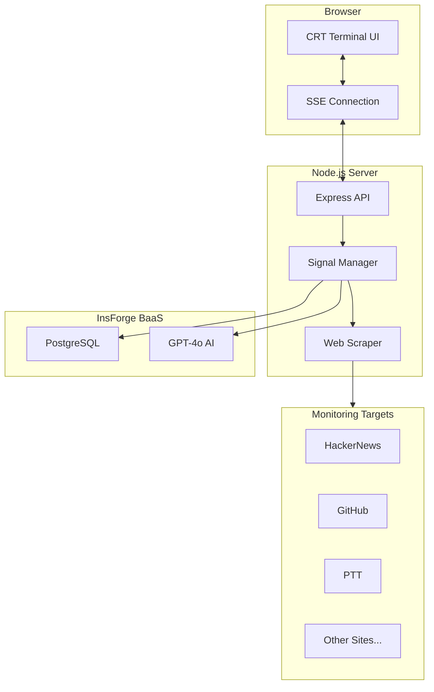

# The Last Sentinel

[](https://www.gnu.org/licenses/agpl-3.0)
[](https://nodejs.org/)
[](https://insforge.com/)

[<- Back to Muripo HQ](https://tznthou.github.io/muripo-hq/) | [中文](README.md)

In the wasteland after the apocalypse, you are the last watchman. Monitor the remaining network signals, searching for any trace of survivors.


> **"Maybe I'm the last one, maybe not. But as long as there's a signal, I'll keep watching."**

---

## Features

- **Multi-Frequency Monitoring**: Watch multiple websites simultaneously, detect content changes in real-time
- **Keyword Interception**: Set custom keywords, trigger alerts when they appear on target sites
- **AI Threat Analysis**: InsForge AI automatically assesses signal threat levels and categories
- **CRT Terminal Interface**: Vintage cathode-ray tube screen effects, complete post-apocalyptic atmosphere
- **Real-time Streaming**: Server-Sent Events push updates without page refresh
- **Signal Archive**: All intercepted signals stored in PostgreSQL for permanent record

---

## Screenshots

### Main Console

```
╔════════════════════════════════════════╗
║   THE LAST SENTINEL                    ║
║   WASTELAND SIGNAL INTERCEPTOR v4.0.1  ║
╚════════════════════════════════════════╝

[LINK] Connection established
[SYSTEM] Watch mode initiated - scanning frequencies...
[SCAN] Scanning: HackerNews Feed...
[SCAN] Scanning: GitHub Trending...

╔════════════════════════════════════════╗
║     !!! SIGNAL INTERCEPTED !!!         ║
╚════════════════════════════════════════╝
SOURCE: HackerNews Feed
KEYWORDS: AI, GPT
THREAT LEVEL: MEDIUM
```

### Threat Levels

| Level | Color | Description |
|-------|-------|-------------|
| **LOW** | Green | General information, no special attention needed |
| **MEDIUM** | Orange | Notable message worth attention |
| **HIGH** | Red | Important signal, immediate review recommended |
| **CRITICAL** | Flashing Red | Emergency signal, may affect survival |

---

## Tech Stack

| Technology | Purpose | Notes |
|------------|---------|-------|
| Node.js 20+ | Runtime | ES Modules |
| Express | Web Framework | API + Static Files |
| InsForge | BaaS | PostgreSQL + AI |
| Server-Sent Events | Real-time Push | Unidirectional Stream |
| Tailwind CSS 3.4 | Styling | Custom CRT Theme |
| Cheerio | HTML Parsing | Web Scraping |

---

## Architecture



---

## Quick Start

### Requirements

- Node.js 20+
- InsForge account (for database and AI)

### Installation

```bash
# Enter project directory
cd day-21-last-sentinel

# Install dependencies
npm install

# Configure environment variables
cp .env.example .env
# Edit .env with your InsForge API Key

# Build Tailwind CSS
npm run build:css

# Start development server
npm run dev
```

Open browser at `http://localhost:3000`

### Environment Variables

```env
# InsForge Configuration
INSFORGE_URL=https://your-project.insforge.app
INSFORGE_ANON_KEY=your-anon-key
INSFORGE_API_KEY=your-api-key

# Server Configuration
PORT=3000

# Scraper Settings (Optional)
USER_AGENT=Mozilla/5.0 ...
MAX_CONTENT_LENGTH=500000
```

### ⚠️ Required Production Environment Variables

When deploying to Zeabur, Vercel, Railway, etc., **you MUST set the following environment variables**, otherwise you'll get 500 errors:

| Variable | Description | Example |
|----------|-------------|---------|
| `ALLOWED_ORIGINS` | **CORS whitelist** (Critical!) Must include your deployed domain | `https://your-app.zeabur.app` |
| `SESSION_SECRET` | Session encryption key. Without it, sessions reset on restart | Generate with `node -e "console.log(require('crypto').randomBytes(32).toString('hex'))"` |
| `INSFORGE_ANON_KEY` | InsForge anonymous key | Get from InsForge Dashboard |

> **📌 Common Error**: Frontend keeps loading or shows 500 error after deployment
>
> **Cause**: Your deployed domain is not added to `ALLOWED_ORIGINS`, causing CORS to block all requests
>
> **Solution**: Set `ALLOWED_ORIGINS=https://your-domain.zeabur.app` in platform environment variables

---

## Usage Guide

### 1. Add Monitoring Frequency

1. Enter target URL in the right panel
2. Set keywords to monitor (comma-separated)
3. Name the frequency (optional)
4. Click `[ADD FREQUENCY]`

### 2. Start Watching

1. Add at least one frequency
2. Click `[INITIATE WATCH]`
3. System will automatically scan all frequencies every 60 seconds

### 3. Manual Scan

Click `[FORCE SCAN]` to immediately scan all frequencies without waiting for the timer.

### 4. View Signals

When keywords are detected:
- Terminal displays alert message
- Screen border glows red
- Modal popup shows detailed content and AI analysis

---

## CRT Visual Effects

This project features carefully crafted vintage CRT terminal effects:

| Effect | Description |
|--------|-------------|
| **Scanlines** | Horizontal lines simulating cathode ray tube |
| **Screen Flicker** | Subtle brightness fluctuation |
| **Chromatic Aberration** | Red-blue color offset |
| **Vignette** | Darkened edges for curved screen effect |
| **Radar Sweep** | Golden angle rotation animation |
| **Signal Alert** | Soft red border glow |

### Low Performance Mode

If animations are too resource-intensive, add `low-performance` class to `<body>`:

```html
<body class="low-performance">
```

This disables scanlines, flicker, and radar animations.

---

## Project Structure

```
day-21-last-sentinel/
├── server/
│   ├── index.js              # Express main app
│   ├── lib/
│   │   ├── insforge.js       # InsForge SDK wrapper
│   │   ├── scraper.js        # Web scraper
│   │   └── signal.js         # Signal management
│   └── routes/
│       ├── stream.js         # SSE streaming routes
│       └── targets.js        # Frequency management API
├── public/
│   ├── index.html            # Main page
│   ├── css/
│   │   ├── main.css          # Tailwind source
│   │   ├── output.css        # Compiled CSS
│   │   └── crt.css           # CRT effect styles
│   └── js/
│       ├── app.js            # Main application
│       ├── boot.js           # Boot animation
│       ├── terminal.js       # Terminal emulation
│       └── typewriter.js     # Typewriter effect
├── package.json
├── tailwind.config.js
├── README.md
└── README_EN.md
```

---

## Database Schema

### targets Table

| Column | Type | Description |
|--------|------|-------------|
| id | UUID | Primary key |
| url | TEXT | Target URL |
| keywords | TEXT[] | Keyword array |
| name | TEXT | Frequency name |
| last_hash | TEXT | Last content hash |
| is_active | BOOLEAN | Active status |
| created_at | TIMESTAMP | Creation time |

### signals Table

| Column | Type | Description |
|--------|------|-------------|
| id | UUID | Primary key |
| target_id | UUID | Related frequency |
| url | TEXT | Source URL |
| keywords | TEXT[] | Matched keywords |
| content | TEXT | Extracted content |
| ai_analysis | JSONB | AI analysis result |
| created_at | TIMESTAMP | Interception time |

---

## Technical Limitations

| Limitation | Description |
|------------|-------------|
| **HTML Only** | Cannot scrape JavaScript-rendered content (SPA sites may be inaccurate) |
| **Simple Text Match** | Keyword matching is case-insensitive string contains check |
| **30s Timeout** | Slow-responding sites are marked as connection failure |
| **No Authentication** | Sites requiring login cannot be monitored (unless cookies are added) |
| **AI Quota Limit** | InsForge AI has usage quota limitations |
| **Geo-restricted Sites** | Sites with regional/IP restrictions (e.g., PTT) may not be accessible from cloud deployments |

---

## Security Audit (2025-12-20)

This project has undergone a comprehensive security audit, with fixes applied from Critical to Low severity issues.

### ✅ Fixed Security Issues

#### Critical
| Code | Issue | Fix |
|------|-------|-----|
| C01 | Frontend using CryptoJS MD5 | Removed, using backend crypto.SHA-256 |
| C02 | Backend using MD5 hashing | Changed to SHA-256 |
| C03 | SSRF vulnerability (arbitrary URL scraping) | Added `validateUrl()` to block internal IPs |
| C04 | Prompt Injection | Implemented `sanitizeInput()` + `sanitizeKeywords()` |
| C05 | XSS vulnerability (innerHTML) | Implemented `escapeHtml()` for all user input |
| C06 | No Rate Limiting | Added express-rate-limit with multiple tiers |
| C07 | Unhandled JSON.parse exception | Implemented `safeJsonParse()` |

#### High
| Code | Issue | Fix |
|------|-------|-----|
| H01 | Hardcoded Session Secret | Using environment variable + random fallback |
| H02 | Insecure Cookie settings | Added httpOnly, secure, sameSite |
| H03 | No CORS configuration | Implemented CORS whitelist |
| H04 | SSE connection without auth | Added session or header validation |
| H05 | AI output not validated | Validating threat_level against allowed values |
| H06 | No Request Body size limit | Added `express.json({ limit: '100kb' })` |
| H07 | Uncontrolled scraper concurrency | Implemented `MAX_CONCURRENT_SCRAPES` |
| H08 | SSE connection memory leak | Fixed cleanup handler duplicate registration |

#### Medium
| Code | Issue | Fix |
|------|-------|-----|
| M01 | No CSP Headers | Added helmet + CSP configuration |
| M03 | No scraper timeout | Added 15s AbortSignal.timeout |
| M05 | Delete without confirmation | Added `confirm()` dialog |
| M09 | CSS assets not verified | Startup validation for required files |

#### Low
| Code | Issue | Fix |
|------|-------|-----|
| L01 | Magic numbers scattered | Organized into named constants |
| L04 | Unused API_BASE variable | Removed |
| L06 | Incomplete package.json | Added repository, bugs, homepage |
| L08 | Environment variables not validated | Startup check for required variables |

### 📋 Pending Items (Technical Debt)

The following items are non-security code quality improvements, optional based on needs:

| Code | Item | Priority |
|------|------|----------|
| M07 | Structured Logging (winston) | Optional |
| M08 | Frontend state management refactor | Optional |
| L02 | TypeScript migration | Optional |
| L03 | Unit tests | Recommended |
| L05 | Dockerization | Optional |
| L07 | API documentation (Swagger) | Optional |

### 🔒 Security Recommendations

For production deployment, ensure:

```env
# Required
INSFORGE_ANON_KEY=your-key

# Recommended
SESSION_SECRET=your-random-secret
NODE_ENV=production
ALLOWED_ORIGINS=https://your-domain.com
```

---

## Customization Guide

### Modify Scan Interval

In `server/lib/signal.js`:

```javascript
const SCAN_INTERVAL = 60 * 1000; // 60 seconds
```

### Modify CRT Colors

In `tailwind.config.js`, modify theme colors:

```javascript
colors: {
  'terminal': {
    'green': '#33ff00',      // Terminal green
    'green-dim': '#1a8000',  // Dark green
    'green-glow': '#66ff33', // Bright green
  },
}
```

Want an amber terminal? Try:

```javascript
colors: {
  'terminal': {
    'green': '#ffb000',
    'green-dim': '#805800',
    'green-glow': '#ffc433',
  },
}
```

### Add Site-Specific Handling

In `server/lib/scraper.js` `getHeaders` function, add special site handling:

```javascript
if (url.includes('your-site.com')) {
  headers['Cookie'] = 'session=xxx';
  headers['Authorization'] = 'Bearer xxx';
}
```

---

## Lore

> Day 247 after the Collapse.
>
> Most infrastructure has crumbled, but some servers still run.
> A data center's backup power, a bunker's satellite connection.
>
> I don't know who else is alive.
> But I can monitor these remaining network nodes, searching for any survivor's message.
>
> Sometimes I receive junk signals—automated news feeds, unmaintained forums.
> Sometimes I receive strange things—maybe other survivors, maybe... something else.
>
> I must be careful.
> Non-human entities may be mimicking human signals.
>
> But I won't stop.
> Because as long as there's a signal, there's hope.

---

## Reflections

### The Watchman's Solitude

While building this project, I kept thinking: what would a real apocalypse look like?

Probably not the dramatic Hollywood scenes. More likely: one day you notice Instagram won't load, then Google won't load, then nothing loads.

Then you start searching, looking for what still works.

This tool does exactly that. Just with the timeline reversed—we prepare the monitoring tool before the apocalypse.

### The Aesthetics of CRT

Why CRT style?

Because no one's using a MacBook Pro after the apocalypse.
You'd probably find some old terminal in a warehouse corner.
Something that works when you plug it in, no OS updates needed.

The screen flickers, colors shift green, but it works.
In the wasteland, "it works" is the highest form of aesthetics.

### For the Vibe Coders

The core of this project is actually simple:
1. `fetch` periodically scrapes pages
2. `cheerio` parses HTML
3. String matching finds keywords
4. SSE pushes to frontend
5. Lots of CSS animations

InsForge makes database and AI super easy—no self-hosting PostgreSQL, no wiring up OpenAI API.

---

## License

This project is licensed under the [AGPL-3.0 License](LICENSE).

This means:
- ✅ Free to use, modify, and distribute
- ✅ Commercial use allowed
- ⚠️ Modified code must be released under the same license
- ⚠️ **Network services must also disclose source code** (key difference from GPL)
